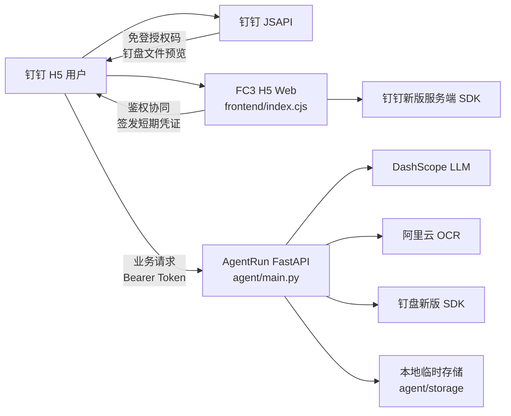
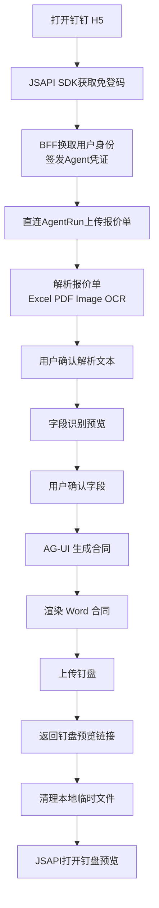
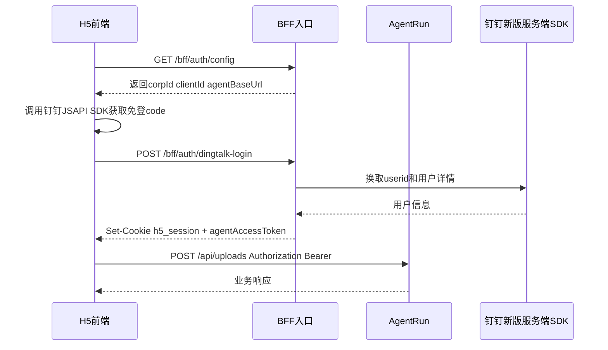

# 合同生成助手架构设计

## 1. 文档信息

| 项目 | 内容 |
| --- | --- |
| 文档名称 | 合同生成助手架构设计 |
| 文档版本 | V1.1 |
| 创建日期 | 2026-05-23 |
| 关联 PRD | [PRD.md](./PRD.md) |
| 适用范围 | 钉钉 H5、BFF 鉴权协同、AgentRun 业务接口、报价单解析、合同生成、钉盘预览交付 |

## 2. 目标与范围

本文档说明合同生成助手 V1 的系统架构、组件职责、运行时拓扑、核心数据流、鉴权链路、第三方依赖和已知实现差距。

PRD 负责描述用户需求、功能范围和验收口径；架构文档负责描述这些需求如何在系统中分层实现。产品侧需求变更应先更新 PRD，涉及组件边界、数据流、部署或第三方集成的变更应同步更新本文档。

## 3. 架构原则

- 前端负责钉钉客户端 JSAPI SDK 能力，包括免登授权码获取、合同结果预览和用户可见交互。
- BFF 只负责前端配套能力，包括静态资源、公开配置、使用钉钉官方新版服务端 SDK 完成免登换取、会话维护和 AgentRun 访问凭证签发。
- AgentRun 只处理业务数据，包括报价单上传、解析、字段识别、合同生成、使用钉盘官方新版 SDK 上传合同和返回预览链接。
- 第三方密钥只保存在服务端运行环境，不能出现在前端代码、页面请求或浏览器存储中。
- 前端直连 AgentRun 业务接口时使用 BFF 签发的短期访问凭证，不依赖跨域 Cookie。
- 报价单解析结果和合同字段必须经过用户确认后再进入合同生成。
- V1 任务状态以浏览器页面内状态为主，不提供服务端任务持久化和跨设备恢复。

## 4. 运行时拓扑

当前部署由两个主要运行单元组成，但职责分为客户端、BFF 和 AgentRun 三层：

- `h5-web`：FC3 自定义运行时，提供 H5 静态资源、`/config.js` 和 BFF 鉴权接口。
- `agent`：AgentRun Python FastAPI 服务，提供业务 API、AG-UI 流式接口、合同生成编排和服务端第三方调用。

### 4.1 物理部署

| 资源 | 配置来源 | 运行内容 | 说明 |
| --- | --- | --- | --- |
| `agent` | [`s.yaml`](../s.yaml) | `agent/bootstrap.sh` 启动 FastAPI | CPU 1.0、内存 2048MB、端口 9000 |
| `h5-web` | [`s.yaml`](../s.yaml) | `frontend/dist` 静态资源和 BFF 鉴权接口 | CPU 0.5、内存 512MB、端口 8000 |

### 4.2 逻辑分层

| 逻辑层 | 物理实现 | 主要职责 |
| --- | --- | --- |
| 前端 H5 | `frontend/src/app.js`、`frontend/src/index.html`、`frontend/src/app.css` | 页面交互、任务列表、用户确认、钉钉客户端 JSAPI SDK 免登和钉盘预览 |
| BFF 鉴权层 | `frontend/src/index.cjs` | 静态资源、`/config.js`、钉钉新版服务端 SDK 免登换取、H5 会话、AgentRun 短期凭证签发 |
| Agent 业务 API | `agent/main.py` | 上传、解析、字段预览、AG-UI 生成、钉盘上传、返回预览链接 |
| 合同处理模块 | `agent/contract/*` | 文本抽取、字段识别、模板渲染、字段契约 |
| 集成模块 | BFF 鉴权层、`agent/dingdrive.py` | 钉钉免登、用户信息、钉盘上传和钉盘预览 |

## 5. 组件职责

### 5.1 前端 H5

前端 H5 负责用户可见流程：

- 调用钉钉客户端 JSAPI SDK 获取免登授权码。
- 展示合同模板选择和报价单上传入口。
- 使用 BFF 签发的短期访问凭证直连 AgentRun，提交报价单和生成请求。
- 展示报价单解析文本，允许用户编辑和补充额外信息。
- 展示字段识别结果，标记已识别字段和待填写字段。
- 维护当前页面内任务列表，限制未完成任务数量。
- 通过 AG-UI SSE 展示合同生成进度和处理日志。
- 使用钉钉客户端 JSAPI SDK 打开钉盘合同预览，预览页自带下载能力。
- 展示上传、解析、字段识别、合同生成、钉盘上传失败原因。

前端不负责：

- 直接调用阿里云 OCR、DashScope、钉钉服务端 SDK 或钉盘服务端 SDK。
- 保存服务端任务状态。
- 持有第三方服务密钥。
- 绕过用户确认直接生成合同。

### 5.2 BFF 鉴权层

BFF 鉴权层部署在前端域名下，用于解决前端域名与 AgentRun 域名不一致时的登录态协同问题。它不承载合同业务数据处理，只与前端配合完成鉴权、会话和 AgentRun 访问凭证签发。

职责包括：

- 提供 H5 静态资源。
- 通过 `/config.js` 向前端注入钉钉客户端配置。
- 接收前端提交的钉钉免登授权码。
- 服务端调用钉钉官方新版服务端 SDK 换取用户身份。
- 维护前端域名下的 H5 会话。
- 为前端签发访问 AgentRun 的短期业务凭证。
- 返回 AgentRun 业务入口地址和凭证过期时间。

BFF 鉴权层不负责：

- 接收或转发报价单文件。
- 解析报价单内容。
- 调用 OCR、LLM 或钉盘服务端 SDK。
- 执行合同模板渲染。
- 保存业务任务状态。

### 5.3 AgentRun API 与编排

AgentRun 由 `agent/main.py` 承担业务 API 和长流程编排。前端通过 BFF 签发的短期访问凭证直连 AgentRun，AgentRun 不依赖前端域名下的 Cookie。

职责包括：

- 校验 BFF 签发的短期访问凭证，获取当前钉钉用户上下文。
- 接收报价单上传并生成上传记录。
- 调用报价单解析模块抽取文本和表格内容。
- 调用字段识别模块生成合同字段预览。
- 通过 AG-UI SSE 编排合同生成过程并输出事件。
- 调用合同渲染模块生成 `.docx` 文件。
- 使用钉盘官方新版 SDK 上传合同。
- 返回钉盘文件预览链接和必要元数据。
- 记录关键阶段日志。
- 在成功生成并上传合同后清理本地临时文件。

AgentRun 不负责：

- 维护前端页面状态。
- 直接操作浏览器任务列表。
- 向前端暴露第三方服务密钥。

### 5.4 合同处理模块

| 模块 | 文件 | 职责 |
| --- | --- | --- |
| 报价单抽取 | `agent/contract/extract.py` | Excel、PDF 和图片 OCR 文本抽取入口 |
| 字段识别 | `agent/contract/llm.py` | 调用 DashScope，根据模板字段契约输出结构化字段 |
| 合同渲染 | `agent/contract/render.py` | 使用 Word 模板生成 `.docx` 合同 |
| 模板配置 | `agent/contract/config.py` | 加载模板名称、模板文件和字段契约 |
| 模板文件 | `agent/contract/templates/zhanweifu/*` | 保存 `.docx` 模板和 `.placeholders.json` 字段契约 |

### 5.5 钉钉与钉盘集成

| 集成对象 | 文件 | 说明 |
| --- | --- | --- |
| 钉钉免登 | BFF 鉴权层 | 使用钉钉官方新版服务端 SDK 通过免登 code 换取 userid，并获取用户详情 |
| AgentRun 访问凭证 | BFF 鉴权层、AgentRun | BFF 签发短期凭证，AgentRun 校验后处理业务请求 |
| 钉盘上传 | `agent/dingdrive.py` | 使用钉盘官方新版 SDK 上传合同文件到指定钉盘空间和目录 |
| 钉盘预览 | 前端钉钉客户端 JSAPI SDK | 使用 AgentRun 返回的预览链接在钉钉客户端打开合同文件 |

## 6. 核心数据流

### 6.1 主业务流程

### 6.2 上传与解析流程

1. 前端读取用户选择的报价单文件。
2. 前端从 BFF 获取 AgentRun 短期访问凭证和 AgentRun 业务入口。
3. 前端调用 AgentRun `POST /api/uploads` 上传文件。
4. AgentRun 校验访问凭证，保存上传文件和上传元数据。
5. 前端调用 AgentRun `POST /api/uploads/{uploadId}/quote-text` 发起解析。
6. AgentRun 根据文件类型选择解析方式：
   - Excel：读取工作表和单元格内容。
   - PDF：抽取页面文本和表格。
   - 图片：调用阿里云 OCR 抽取文本和表格。
7. AgentRun 返回可编辑 `quoteText`。
8. 前端展示解析文本，用户可编辑和补充额外信息。

### 6.3 字段识别与合同生成流程

1. 前端调用 `POST /api/uploads/{uploadId}/field-preview`，提交用户确认后的 `quoteText`、`extraInfo` 和 `templateType`。
2. AgentRun 加载模板字段契约。
3. AgentRun 调用 DashScope 识别结构化字段。
4. AgentRun 返回已识别字段、缺失字段和表格行数。
5. 前端展示字段预览，待填写字段只作为确认界面提示。
6. 用户确认后调用 `POST /ag-ui/agent`，AgentRun 使用用户确认后的字段数据渲染合同；仍缺失的字段在生成的 Word 合同中渲染为空白。
7. AgentRun 上传合同到钉盘。
8. AgentRun 通过 AG-UI 事件返回进度、日志和合同预览信息。

### 6.4 钉盘预览流程

1. 前端从 `contract_generated` 事件获得钉盘预览入口。
2. AgentRun 返回钉盘 `spaceId`、`fileId`、`fileName`、`openUrl` 或 `previewUrl`。
3. 前端优先使用钉钉客户端 JSAPI SDK 打开钉盘文件预览。
4. 钉盘预览页提供下载能力，前端不再代理下载文件流。
5. 若客户端不支持预览能力，可降级为打开 `openUrl`。

## 7. 鉴权设计

后续业务请求必须携带 BFF 签发的 AgentRun 短期访问凭证。AgentRun 校验凭证后获得当前用户上下文，未通过鉴权的请求不得进入上传、解析、字段识别或合同生成流程。

## 8. 接口边界

| 接口 | 所属层 | 作用 |
| --- | --- | --- |
| `GET /bff/auth/config` | BFF | 查询前端公开配置和 AgentRun 地址 |
| `GET /bff/auth/me` | BFF | 查询当前 H5 登录用户 |
| `POST /bff/auth/dingtalk-login` | BFF | 完成钉钉免登并签发 AgentRun 访问凭证 |
| `POST /bff/auth/agent-token` | BFF | 刷新短期 AgentRun 访问凭证 |
| `POST /api/uploads` | Agent API | 上传报价单并生成上传记录 |
| `POST /api/uploads/{uploadId}/quote-text` | Agent API | 解析报价单文本和表格 |
| `POST /api/uploads/{uploadId}/field-preview` | Agent API | 识别并返回合同字段预览 |
| `POST /ag-ui/agent` | Agent API | 通过 SSE 编排合同生成流程 |

详细接口契约见 [API.md](./API.md)。

## 9. AG-UI 事件约定

合同生成主路径使用 `POST /ag-ui/agent`，前端通过 SSE 接收事件。

| 事件 | 用途 |
| --- | --- |
| `RUN_STARTED` | 标记生成流程开始 |
| `TEXT_MESSAGE_START` | 标记日志消息开始 |
| `TEXT_MESSAGE_CONTENT` | 输出生成过程日志或失败原因 |
| `TEXT_MESSAGE_END` | 标记日志消息结束 |
| `CUSTOM contract_generated` | 返回合同 ID、文件名、钉盘信息和预览入口 |
| `RUN_FINISHED` | 标记生成流程成功结束 |
| `RUN_ERROR` | 标记生成失败，携带失败原因 |

前端收到 `RUN_ERROR` 时必须保留任务上下文，展示失败原因，并允许用户重试。

## 10. 数据与临时文件

| 数据 | 位置 | 生命周期 |
| --- | --- | --- |
| 上传报价单 | `agent/storage/uploads` | 上传后保存，合同生成成功后清理 |
| 生成合同 | `agent/storage/contracts` | 渲染后保存，上传钉盘成功后清理 |
| 草稿或中间文件 | `agent/storage/drafts` | 按具体流程临时使用 |
| 合同模板 | `agent/contract/templates/zhanweifu` | 随代码发布 |
| 模板字段契约 | `*.placeholders.json` | 随模板维护 |

临时文件清理由 AgentRun 在合同生成成功后执行。若合同生成或钉盘上传失败，应优先保留必要上下文，便于用户重试和研发排查。

## 11. 配置与密钥

主要配置由 [`s.yaml`](../s.yaml) 注入。

| 配置 | 用途 | 可见范围 |
| --- | --- | --- |
| `DINGTALK_CLIENT_ID` | 前端钉钉 JSAPI 免登 | 前端可见 |
| `DINGTALK_CORP_ID` | 钉钉企业 ID | 前端可见 |
| `DINGTALK_CLIENT_SECRET` | 钉钉服务端接口密钥 | 仅 BFF |
| `APP_SESSION_SECRET` | H5 会话和 AgentRun 短期凭证签名 | 仅 BFF / AgentRun |
| `DASHSCOPE_API_KEY` | LLM 字段识别 | 仅 AgentRun |
| `DASHSCOPE_MODEL` | LLM 模型 | 仅 AgentRun |
| `ALIYUN_ACCESS_KEY_ID` | 阿里云 OCR 访问凭证 | 仅 AgentRun |
| `ALIYUN_ACCESS_KEY_SECRET` | 阿里云 OCR 访问凭证 | 仅 AgentRun |
| `ALIYUN_OCR_ENDPOINT` | OCR 服务端点 | 仅 AgentRun |
| `DINGTALK_DRIVE_SPACE_ID` | 钉盘空间 | 仅 AgentRun |
| `DINGTALK_DRIVE_PARENT_ID` | 钉盘目标目录 | 仅 AgentRun |
| `DINGTALK_DRIVE_CONFLICT_POLICY` | 钉盘同名冲突策略 | 仅 AgentRun |
| `AGENT_ENDPOINT` | AgentRun 业务入口 | H5 服务可见，前端通过 BFF 获取 |

前端页面只允许拿到完成免登所需的公开配置，不允许暴露服务端密钥。

### 11.1 SDK 使用约束

- 钉钉免登、用户身份换取、用户详情查询必须使用钉钉官方新版服务端 SDK，不再新增旧版 OAPI 或手写 HTTP 调用。
- 钉盘合同上传、文件元数据获取和预览链接获取必须使用钉盘官方新版 SDK，不再新增旧版 Storage API 手写调用。
- 前端只使用钉钉客户端 JSAPI SDK 获取免登授权码和打开钉盘预览，不持有服务端 access token。
- SDK 调用异常应在服务端转换为稳定错误码和用户可理解文案。

## 12. 错误处理

| 阶段 | 处理原则 |
| --- | --- |
| 鉴权失败 | 阻止业务操作，引导用户重新进入钉钉应用或刷新页面 |
| 上传失败 | 返回可读错误，允许重新选择文件 |
| 解析失败 | 保留上传任务，展示解析失败原因 |
| OCR 失败 | 展示图片识别失败原因，提示检查图片清晰度后重试 |
| 字段识别失败 | 保留解析文本和补充信息，允许用户修改后重试 |
| 合同生成失败 | 保留字段上下文，展示生成失败原因 |
| 钉盘上传失败 | 展示钉盘上传失败原因，允许重试生成或重新提交 |
| 预览失败 | 展示预览失败原因，允许用户重新打开钉盘文件 |

## 13. 可观测性

V1 主要依赖 AgentRun 日志和前端任务日志排障。

- AgentRun 日志应覆盖鉴权、上传、解析、字段识别、合同生成、钉盘上传和清理阶段。
- AG-UI `TEXT_MESSAGE_CONTENT` 用于向用户展示生成过程中的关键进度。
- 前端任务日志用于保存当前页面内任务的处理过程。
- 第三方调用失败应记录服务名、阶段、耗时和可定位的错误信息。

## 14. 当前实现差距

| 项目 | PRD 目标 | 当前实现状态 | 后续动作 |
| --- | --- | --- | --- |
| 图片报价单 OCR | 支持 `.jpg`、`.jpeg`、`.png` 图片 OCR | 已接入图片解析入口和 OCR SDK 调用封装 | 需在真实 OCR 环境验证识别质量和错误码 |
| 前端文件选择 | 支持 Excel、PDF、图片 | 已更新 H5 文件选择提示和 `accept` | 后续根据 OCR 质量补充图片清晰度提示 |
| 鉴权边界 | BFF 负责免登和 AgentRun 短期凭证，AgentRun 只处理业务请求 | 已迁移为 BFF `/bff/auth/*` + AgentRun Bearer 鉴权，BFF 内部钉钉调用使用官方新版 SDK | 后续在真实钉钉环境验证新版 SDK 免登字段稳定性 |
| 业务请求路径 | 前端直连 AgentRun 业务接口 | 已改为 `agentBaseUrl` + Bearer Token | 部署时确保 AgentRun CORS 允许 H5 域名 |
| 合同交付 | 前端使用钉钉客户端 JSAPI SDK 预览钉盘文件 | 已返回 `preview` 结构并由前端打开预览入口 | 继续确认钉盘新版 SDK 的稳定预览 URL 字段 |
| TXT 输入 | PRD 不将 TXT 作为正式业务格式 | 上传入口已按正式格式白名单拒绝 TXT | 后续若需内部测试文本输入，应使用独立开发工具而非正式业务 API |
| 服务端任务持久化 | V1 不包含 | 当前任务状态在前端内存中维护 | 后续若做跨端恢复再设计服务端任务表 |

## 15. 后续扩展方向

- 图片 OCR 接入后，抽象统一的报价单解析接口，屏蔽 Excel、PDF、图片差异。
- 增加服务端任务持久化，支持刷新页面后恢复任务。
- 增加钉盘上传失败自动重试。
- 按日期、用户或项目自动归档钉盘目录。
- 增加结构化合同生成记录，用于查询、统计和审计。
