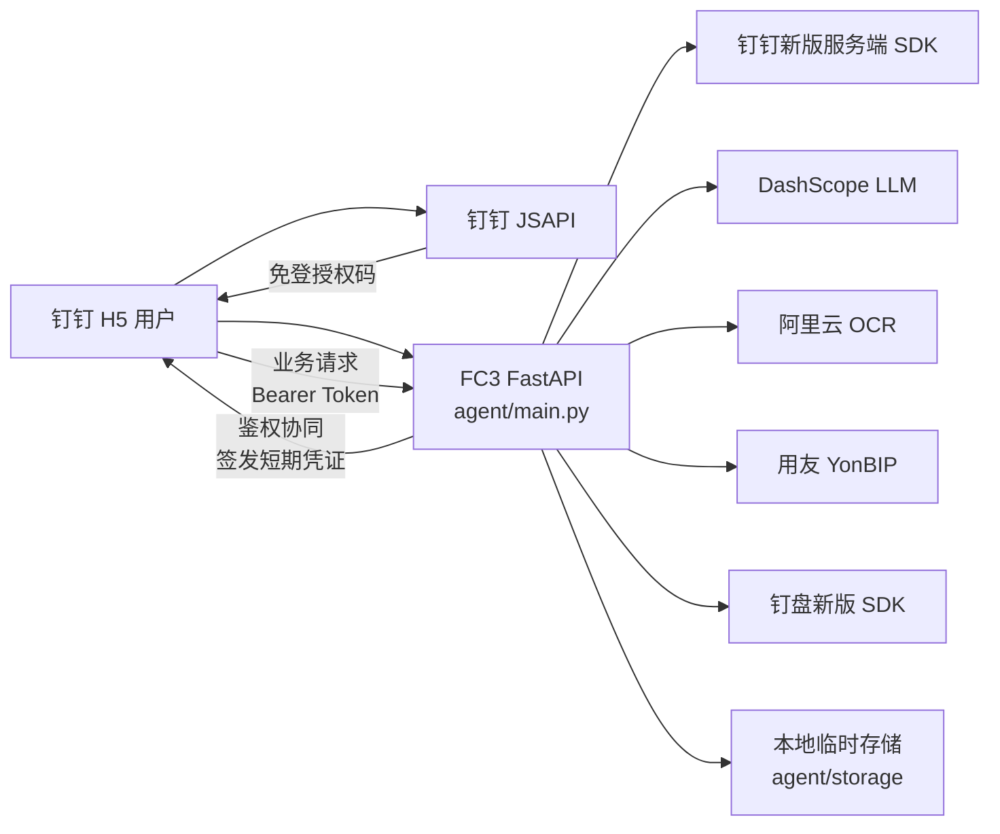
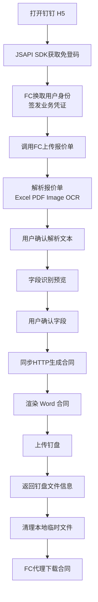
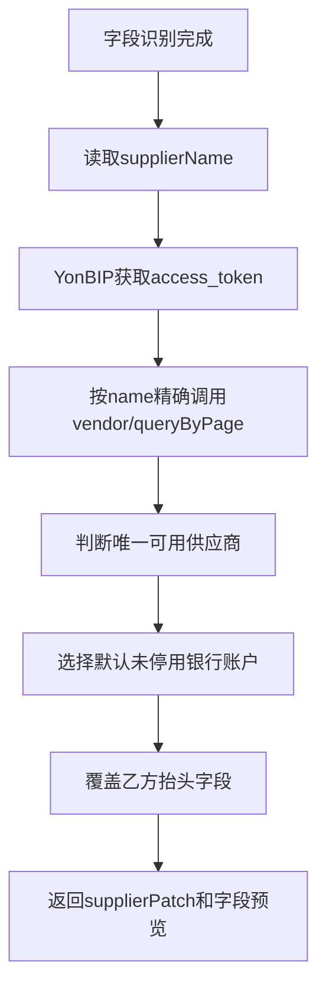
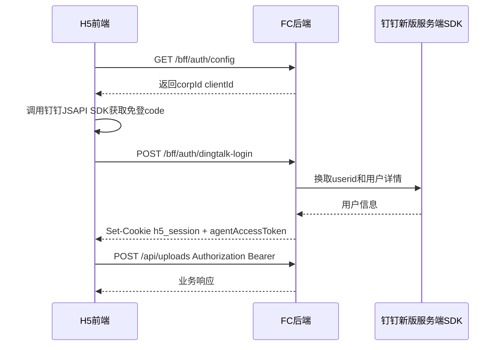

# 合同生成助手架构设计

## 1. 文档信息

| 项目 | 内容 |
| --- | --- |
| 文档名称 | 合同生成助手架构设计 |
| 文档版本 | V1.2 |
| 创建日期 | 2026-05-23 |
| 关联 PRD | [PRD.md](./PRD.md) |
| 适用范围 | 钉钉 H5、FC 鉴权与业务接口、报价单解析、合同生成、钉盘下载交付 |

## 2. 目标与范围

本文档说明合同生成助手 V1 的系统架构、组件职责、运行时拓扑、核心数据流、鉴权链路、第三方依赖和已知实现差距。

PRD 负责描述用户需求、功能范围和验收口径；架构文档负责描述这些需求如何在系统中分层实现。产品侧需求变更应先更新 PRD，涉及组件边界、数据流、部署或第三方集成的变更应同步更新本文档。

## 3. 架构原则

- 前端负责钉钉客户端 JSAPI SDK 免登授权码获取、合同下载入口和用户可见交互。
- FC 后端统一提供静态资源、公开配置、钉钉免登换取、会话维护、短期业务凭证签发和业务 API。
- 业务 API 处理报价单上传、解析、字段识别、合同生成、使用钉盘官方新版 SDK 上传合同和代理下载合同文件。
- 第三方密钥只保存在服务端运行环境，不能出现在前端代码、页面请求或浏览器存储中。
- 前端调用同域 FC 业务接口时使用后端签发的短期访问凭证，不依赖跨域 Cookie。
- 报价单解析结果和合同字段必须经过用户确认后再进入合同生成。
- V1 任务状态以浏览器页面内状态为主，不提供服务端任务持久化和跨设备恢复。

## 4. 运行时拓扑

当前部署收敛为一个 FC3 自定义运行时，职责仍按客户端、鉴权和业务 API 分层：

- `app`：FC3 自定义运行时，启动 `agent/bootstrap.sh` 运行 FastAPI，提供 H5 静态资源、`/config.js`、`/bff/auth/*` 鉴权接口和业务 API。

### 4.1 物理部署

| 资源 | 配置来源 | 运行内容 | 说明 |
| --- | --- | --- | --- |
| `app` | [`s.yaml`](../s.yaml) | `agent/bootstrap.sh` 启动 FastAPI，托管 `agent/static` 前端资源和业务 API | CPU 0.5、内存 1024MB、端口 9000 |

### 4.2 逻辑分层

| 逻辑层 | 物理实现 | 主要职责 |
| --- | --- | --- |
| 前端 H5 | `frontend/src/app.js`、`frontend/src/index.html`、`frontend/src/app.css` | 页面交互、任务列表、用户确认、钉钉客户端 JSAPI SDK 免登和合同下载 |
| 鉴权与静态资源层 | `agent/main.py`、`agent/static` | 静态资源、`/config.js`、钉钉新版服务端 SDK 免登换取、H5 会话、短期业务凭证签发 |
| 业务 API | `agent/main.py` | 上传、解析、字段预览、用友抬头回填、同步 HTTP 生成、钉盘上传、代理下载合同 |
| 合同处理模块 | `agent/contract/*` | 文本抽取、字段识别、模板渲染、字段契约 |
| 集成模块 | `agent/dingtalk_oapi.py`、`agent/dingdrive.py`、`agent/yonyou_vendor.py` | 钉钉免登、用户信息、钉盘上传和下载信息获取、用友供应商档案实时查询 |

## 5. 组件职责

### 5.1 前端 H5

前端 H5 负责用户可见流程：

- 调用钉钉客户端 JSAPI SDK 获取免登授权码。
- 展示合同模板选择和报价单上传入口。
- 使用 FC 后端签发的短期访问凭证提交报价单和生成请求。
- 展示报价单解析文本，允许用户编辑和补充额外信息。
- 展示字段识别结果，标记已识别字段和待填写字段。
- 维护当前页面内任务列表，限制未完成任务数量。
- 通过同步 HTTP 生成合同并展示生成结果。
- 通过 FC 下载接口下载钉盘合同文件，并提示用户保存位置。
- 展示上传、解析、字段识别、合同生成、钉盘上传失败原因。

前端不负责：

- 直接调用阿里云 OCR、DashScope、钉钉服务端 SDK 或钉盘服务端 SDK。
- 保存服务端任务状态。
- 持有第三方服务密钥。
- 绕过用户确认直接生成合同。

### 5.2 鉴权与静态资源层

鉴权与静态资源层由同一个 FC FastAPI 服务提供，用于托管 H5 页面、完成钉钉免登、维护 H5 会话和签发业务访问凭证。它与业务 API 同域部署，不再需要独立 H5 BFF 函数。

职责包括：

- 提供 H5 静态资源。
- 通过 `/config.js` 向前端注入钉钉客户端配置。
- 接收前端提交的钉钉免登授权码。
- 服务端调用钉钉官方新版服务端 SDK 换取用户身份。
- 维护前端域名下的 H5 会话。
- 为前端签发短期业务凭证。
- 返回凭证过期时间；纯 FC 同域部署时业务入口可使用相对路径。

BFF 鉴权层不负责：

- 接收或转发报价单文件。
- 解析报价单内容。
- 调用 OCR、LLM 或钉盘服务端 SDK。
- 执行合同模板渲染。
- 保存业务任务状态。

### 5.3 业务 API 与编排

业务 API 由 `agent/main.py` 承担。前端通过同一 FC 服务签发的短期访问凭证调用业务接口，业务接口不依赖 H5 Cookie。

职责包括：

- 校验 BFF 签发的短期访问凭证，获取当前钉钉用户上下文。
- 接收报价单上传并生成上传记录。
- 调用报价单解析模块抽取文本和表格内容。
- 调用字段识别模块生成合同字段预览。
- 通过同步 HTTP 接口编排合同生成过程并返回结果。
- 调用合同渲染模块生成 `.docx` 文件。
- 使用钉盘官方新版 SDK 上传合同。
- 字段识别后按乙方名称实时只读查询用友 YonBIP 供应商档案，覆盖乙方抬头字段。
- 返回钉盘文件信息和必要下载元数据。
- 记录关键阶段日志。
- 在成功生成并上传合同后清理本地临时文件。

业务 API 不负责：

- 维护前端页面状态。
- 直接操作浏览器任务列表。
- 向前端暴露第三方服务密钥。

### 5.4 合同处理模块

| 模块 | 文件 | 职责 |
| --- | --- | --- |
| 报价单抽取 | `agent/contract/extract.py` | Excel、PDF 和图片 OCR 文本抽取入口 |
| 字段识别 | `agent/contract/llm.py` | 调用 DashScope，根据模板字段契约输出结构化字段 |
| 合同渲染 | `agent/contract/render.py` | 使用 Word 模板生成 `.docx` 合同 |
| 模板配置 | `agent/contract/config.py` | 加载模板名称、模板文件和字段契约 |
| 模板文件 | `agent/contract/templates/zhanweifu/*` | 保存 `.docx` 模板和 `.placeholders.json` 字段契约 |

### 5.5 钉钉与钉盘集成

| 集成对象 | 文件 | 说明 |
| --- | --- | --- |
| 钉钉免登 | 鉴权与静态资源层 | 使用钉钉官方新版服务端 SDK 通过免登 code 换取 userid，并获取用户详情 |
| 业务访问凭证 | 鉴权与静态资源层、业务 API | 后端签发短期凭证，业务 API 校验后处理业务请求 |
| 钉盘上传 | `agent/dingdrive.py` | 使用钉盘官方新版 SDK 上传合同文件到指定钉盘空间和目录 |
| 钉盘下载 | `agent/dingdrive.py`、前端 H5 | FC 后端获取钉盘下载信息并代理文件流，前端触发浏览器或钉钉客户端下载 |
| 用友抬头回填 | `agent/yonyou_vendor.py`、`agent/main.py` | 使用 YonBIP 开放 API 按乙方名称查询供应商主档和银行子表 |

## 6. 核心数据流

### 6.1 主业务流程

### 6.2 上传与解析流程

1. 前端读取用户选择的报价单文件。
2. 前端从 FC 后端获取短期业务访问凭证。
3. 前端调用 `POST /api/uploads` 上传文件。
4. FC 后端校验访问凭证，保存上传文件和上传元数据。
5. 前端调用 `POST /api/uploads/{uploadId}/quote-text` 发起解析。
6. FC 后端根据文件类型选择解析方式：
   - Excel：读取工作表和单元格内容。
   - PDF：抽取页面文本和表格。
   - 图片：调用阿里云 OCR 抽取文本和表格。
7. FC 后端返回可编辑 `quoteText`。
8. 前端展示解析文本，用户可编辑和补充额外信息。

### 6.3 字段识别与合同生成流程

1. 前端调用 `POST /api/uploads/{uploadId}/field-preview`，提交用户确认后的 `quoteText`、`extraInfo` 和 `templateType`。
2. FC 后端加载模板字段契约。
3. FC 后端调用 DashScope 识别结构化字段。
4. FC 后端返回已识别字段、缺失字段和表格行数。
5. 前端展示字段预览，待填写字段只作为确认界面提示。
6. 用户确认后调用 `POST /api/contracts/generate`，FC 后端使用用户确认后的字段数据渲染合同；仍缺失的字段在生成的 Word 合同中渲染为空白。
7. FC 后端上传合同到钉盘。
8. FC 后端一次性返回钉盘文件信息和下载提示。

### 6.4 钉盘下载流程

1. 前端从 `POST /api/contracts/generate` 响应获得钉盘 `spaceId`、`fileId` 和 `fileName`。
2. 用户点击下载后，前端携带业务 Bearer Token 调用 `POST /api/dingdrive/download`。
3. FC 后端调用钉盘 `GetFileDownloadInfo` 获取下载 URL 和 headers。
4. FC 后端代理下载文件流并返回给前端。
5. 前端触发浏览器或钉钉客户端下载，并提示用户文件会保存到默认下载目录；如系统弹窗提示，可选择目标保存位置。

### 6.5 用友供应商抬头实时回填流程

1. 字段识别完成后，FC 后端读取 `extractedData.supplierName`。
2. FC 后端使用 `YONBIP_APP_KEY`、`YONBIP_APP_SECRET` 获取用友访问令牌。
3. FC 后端调用 `POST /yonbip/digitalModel/vendor/queryByPage`，请求体包含：
   - 显式供应商主档字段：`id`、`code`、`name`、`creditcode`、`address`、`contactphone`、`vendorphone`、`vendorfax`、`vendoraddress`、`orgId`、`org`、`accessstatus`、`freezestatus`、`pubts`
   - `condition.simpleVOs: [{ field: "name", op: "eq", value1: supplierName }]`
   - `queryOrders: [{ field: "code", order: "asc" }]`
   - `partParam.vendorbanks.data: "*,openaccountbank.name"`
   - `partParam.vendorcontactss.data: "*"`
4. FC 后端只接受唯一可用供应商；未命中、多条命中或接口失败时返回提示，不阻塞字段确认和合同生成。
5. FC 后端从 `vendorbanks` 中选择 `defaultbank=true` 且 `stopstatus=false` 的银行账户；若不存在默认账户，则选择第一条未停用账户。
6. FC 后端从 `vendorcontactss` 中选择 `defaultcontact=true` 的联系人；若分页响应没有联系人子表，则按唯一供应商补查详情接口。
7. FC 后端以用友返回的乙方抬头信息为准，覆盖乙方名称、税号、地址、电话、开户行、银行账号、乙方代表姓名、电话、邮箱等字段。
8. 若用友未返回合同需要的抬头字段，`supplierPatch.missingYonbipFields` 返回缺失项，前端提示用户到用友系统补充供应商档案。
9. FC 后端不生成、不下载、不上传 `supplier-cache.xlsx`，也不在合同生成后写回供应商档案。

## 7. 鉴权设计

后续业务请求必须携带 FC 后端签发的短期访问凭证。业务 API 校验凭证后获得当前用户上下文，未通过鉴权的请求不得进入上传、解析、字段识别或合同生成流程。

## 8. 接口边界

| 接口 | 所属层 | 作用 |
| --- | --- | --- |
| `GET /bff/auth/config` | 鉴权与静态资源层 | 查询前端公开配置 |
| `GET /bff/auth/me` | 鉴权与静态资源层 | 查询当前 H5 登录用户 |
| `POST /bff/auth/dingtalk-login` | 鉴权与静态资源层 | 完成钉钉免登并签发业务访问凭证 |
| `POST /bff/auth/agent-token` | 鉴权与静态资源层 | 刷新短期业务访问凭证 |
| `POST /api/uploads` | 业务 API | 上传报价单并生成上传记录 |
| `POST /api/uploads/{uploadId}/quote-text` | 业务 API | 解析报价单文本和表格 |
| `POST /api/uploads/{uploadId}/field-preview` | 业务 API | 识别并返回合同字段预览 |
| `POST /api/contracts/generate` | 业务 API | 同步生成合同并返回钉盘文件信息 |
| `POST /api/dingdrive/download` | 业务 API | 获取钉盘下载信息并返回合同文件流 |

详细接口契约见 [API.md](./API.md)。

## 9. 合同生成接口约定

合同生成主路径使用 `POST /api/contracts/generate` 同步 HTTP 请求。前端只在用户点击生成时发起请求，等待返回后展示钉盘文件信息和下载入口，不使用 SSE、WebSocket 或常规定时轮询。

前端收到生成失败响应时必须保留任务上下文，展示失败原因，并允许用户重试。

## 10. 数据与临时文件

| 数据 | 位置 | 生命周期 |
| --- | --- | --- |
| 上传报价单 | `agent/storage/uploads` | 上传后保存，合同生成成功后清理 |
| 生成合同 | `agent/storage/contracts` | 渲染后保存，上传钉盘成功后清理 |
| 草稿或中间文件 | `agent/storage/drafts` | 按具体流程临时使用 |
| 合同模板 | `agent/contract/templates/zhanweifu` | 随代码发布 |
| 模板字段契约 | `*.placeholders.json` | 随模板维护 |

临时文件清理由 FC 后端在合同生成成功后执行。若合同生成或钉盘上传失败，应优先保留必要上下文，便于用户重试和研发排查。

## 11. 配置与密钥

主要配置由 [`s.yaml`](../s.yaml) 注入。

| 配置 | 用途 | 可见范围 |
| --- | --- | --- |
| `DINGTALK_CLIENT_ID` | 前端钉钉 JSAPI 免登 | 前端可见 |
| `DINGTALK_CORP_ID` | 钉钉企业 ID | 前端可见 |
| `DINGTALK_CLIENT_SECRET` | 钉钉服务端接口密钥 | 仅 FC 后端 |
| `APP_SESSION_SECRET` | H5 会话和短期业务凭证签名 | 仅 FC 后端 |
| `DASHSCOPE_API_KEY` | LLM 字段识别 | 仅 FC 后端 |
| `DASHSCOPE_MODEL` | LLM 模型 | 仅 FC 后端 |
| `ALIYUN_ACCESS_KEY_ID` | 阿里云 OCR 访问凭证 | 仅 FC 后端 |
| `ALIYUN_ACCESS_KEY_SECRET` | 阿里云 OCR 访问凭证 | 仅 FC 后端 |
| `ALIYUN_OCR_ENDPOINT` | OCR 服务端点 | 仅 FC 后端 |
| `DINGTALK_DRIVE_SPACE_ID` | 钉盘空间 | 仅 FC 后端 |
| `DINGTALK_DRIVE_PARENT_ID` | 钉盘目标目录 | 仅 FC 后端 |
| `DINGTALK_DRIVE_CONFLICT_POLICY` | 钉盘同名冲突策略 | 仅 FC 后端 |
| `YONBIP_APP_KEY` | 用友 YonBIP 自建应用 Key | 仅 FC 后端 |
| `YONBIP_APP_SECRET` | 用友 YonBIP 自建应用 Secret | 仅 FC 后端 |
| `YONBIP_GATEWAY_URL` | 用友业务接口域名，默认 `https://c3.yonyoucloud.com/iuap-api-gateway`，仅需跨数据中心时覆盖 | 仅 FC 后端 |
| `YONBIP_TOKEN_URL` | 用友 token 接口域名，默认与 `YONBIP_GATEWAY_URL` 相同 | 仅 FC 后端 |

前端页面只允许拿到完成免登所需的公开配置，不允许暴露服务端密钥。

### 11.1 SDK 使用约束

- 钉钉免登、用户身份换取、用户详情查询必须使用钉钉官方新版服务端 SDK，不再新增旧版 OAPI 或手写 HTTP 调用。
- 钉盘合同上传、文件元数据获取和下载信息获取必须使用钉盘官方新版 SDK，不再新增旧版 Storage API 手写调用。
- 前端只使用钉钉客户端 JSAPI SDK 获取免登授权码，不持有服务端 access token 或钉盘下载签名 headers。
- SDK 调用异常应在服务端转换为稳定错误码和用户可理解文案。

## 12. 错误处理

| 阶段 | 处理原则 |
| --- | --- |
| 鉴权失败 | 阻止业务操作，引导用户重新进入钉钉应用或刷新页面 |
| 上传失败 | 返回可读错误，允许重新选择文件 |
| 解析失败 | 保留上传任务，展示解析失败原因 |
| OCR 失败 | 展示图片识别失败原因，提示检查图片清晰度后重试 |
| 字段识别失败 | 保留解析文本和补充信息，允许用户修改后重试 |
| 合同生成失败 | 保留字段上下文，展示生成失败原因 |
| 钉盘上传失败 | 展示钉盘上传失败原因，允许重试生成或重新提交 |
| 下载失败 | 展示下载失败原因，允许用户重试下载或到钉盘目录手动下载 |
| 用友抬头查询失败 | 展示用友抬头未自动补齐原因，不影响报价单任务继续处理 |

## 13. 可观测性

V1 主要依赖 FC 日志和前端任务日志排障。

- FC 日志应覆盖鉴权、上传、解析、字段识别、用友抬头查询、合同生成、钉盘上传和清理阶段。
- 前端在同步请求开始、成功和失败时记录任务日志。
- 前端任务日志用于保存当前页面内任务的处理过程。
- 第三方调用失败应记录服务名、阶段、耗时和可定位的错误信息。

## 14. 当前实现差距

| 项目 | PRD 目标 | 当前实现状态 | 后续动作 |
| --- | --- | --- | --- |
| 图片报价单 OCR | 支持 `.jpg`、`.jpeg`、`.png` 图片 OCR | 已接入图片解析入口和 OCR SDK 调用封装 | 需在真实 OCR 环境验证识别质量和错误码 |
| 前端文件选择 | 支持 Excel、PDF、图片 | 已更新 H5 文件选择提示和 `accept` | 后续根据 OCR 质量补充图片清晰度提示 |
| 鉴权边界 | FC 后端负责免登和短期业务凭证，业务 API 校验 Bearer Token | 已迁移为同一 FC 内 `/bff/auth/*` + Bearer 鉴权，钉钉调用使用官方新版 SDK | 后续在真实钉钉环境验证新版 SDK 免登字段稳定性 |
| 业务请求路径 | 前端同域调用 FC 业务接口 | 已改为相对路径 + Bearer Token | 部署时确保自定义域名指向单个 FC 服务 |
| 合同交付 | 前端通过 FC 下载钉盘文件 | 已返回 `dingDrive` 和 `download` 结构，并由 FC 代理下载合同文件 | 继续确认钉盘下载信息接口在真实环境的权限配置 |
| 用友抬头回填 | 字段识别后按乙方名称实时查询用友供应商主档和默认银行信息 | 已替换原供应商缓存同步链路 | 需在真实 YonBIP 环境验证名称精确查询、银行子表、限流和缺失字段提示 |
| TXT 输入 | PRD 不将 TXT 作为正式业务格式 | 上传入口已按正式格式白名单拒绝 TXT | 后续若需内部测试文本输入，应使用独立开发工具而非正式业务 API |
| 服务端任务持久化 | V1 不包含 | 当前任务状态在前端内存中维护 | 后续若做跨端恢复再设计服务端任务表 |

## 15. 后续扩展方向

- 图片 OCR 接入后，抽象统一的报价单解析接口，屏蔽 Excel、PDF、图片差异。
- 增加服务端任务持久化，支持刷新页面后恢复任务。
- 增加钉盘上传失败自动重试。
- 按日期、用户或项目自动归档钉盘目录。
- 增加结构化合同生成记录，用于查询、统计和审计。
